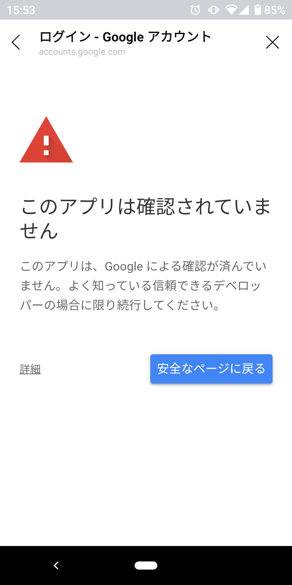

# 家計bot
### 概要
- 現在、β版を公開しています。
- 
- ※現在、OAuth認証設定を申請中のため、スプレッドシート登録時に下記の画面が表示されます。  
画面下部の「詳細」⇒「(安全ではないページ)に移動」をクリックして進めると、スプレッドシートの登録が可能です。
- 
### 環境構築の流れ
- 前提
  - 下記についての知識がある前提で、以降を記述(※詳細な設定方法等については省略)
    - heroku
    - LINE API
      - LINE Messaging API、LINE Login、LIFF
    - Google Cloud Platform(以降、GCP)
1. サーバー準備
    - 基本的には何でもよし  
      (※以降、herokuを使用する前提で記述)
2. デプロイ
    - herokuに新規アプリ作成
    - cloneしたソースをコミット/プル
    - DBを使用する場合は、heroku postgresをインストール
3. LINEの設定
    - LINE Messaging API作成
    - LINE Login作成
    - LIFF設定
      - LINE Loginにアクセスし、下記二つのLIFFを設定
        - シート登録
          - サイズ：Full
          - エンドポイント：https://xxx/views/regist_master
          - Scope：chat_message.write, openid, profile
        - 収支登録
          - サイズ：Full
          - エンドポイント：https://xxx/liff_RegistExpence.html
          - Scope：chat_message.write, profile
    - リッチメニュー作成
      - リッチメニュー設定画面にアクセス
      - テンプレート小(3分割)を選択
      - 「other/メニューデザイン3.png」をアップロード
      - 各メニューへ以下を登録
        - メニューA：支出登録のLIFF URLをリンク設定
        - メニューB：「支出一覧表示」をテキスト設定
        - メニューC：シート登録のLIFF URLをリンク設定
4. GCPの設定
    - APIの有効化
      - 「APIとサービス」のライブラリにて、下記を有効化
        - Google Drive API
        - Google Sheets API
    - サービスアカウントの取得
      - GCPの「APIとサービス」の「認証情報」にて、「サービスアカウント」を選択し、作成
      - 作成後、JSON形式で鍵を作成し、ダウンロード(環境変数の設定で使用)
    - OAuth2.0クライアントIDの設定
      - GCPの「APIとサービス」の「認証情報」にて、「OAuth2.0クライアントID」を選択し、作成
        - アプリ種類：ウェブアプリケーション
        - 承認済みのリダイレクトURI：https://xxx/auth/oauth2callback
      - OAuth同意画面にて各種情報を登録
        - 承認済みドメイン：サーバーのドメイン
        - スコープ：Google Drive API(Google ドライブのすべてのファイルの表示、編集、作成、削除)
      - 登録後、公開ステータスを本番環境に変更
5. 環境変数の設定
    - LINE_ACCESS_TOKEN
      - 登録したLINE Messageのアクセストークン
    - LINE_CHANNEL_SECRET
      - 登録したLINE Messageのチャンネルシークレット
    - REGIST_EXPENCE_LIFF_ID
      - 支出登録画面のLIFF ID
    - REGIST_MASTER_LIFF_ID
      - スプレッドシート登録画面のLIFF ID
    - GOOGLE_AUTH_EMAIL
      - ユーザが登録したスプレッドシートへ書き込みするためのアカウント
      - GCPのサービスアカウントの「client_email」を設定
    - GOOGLE_AUTH_PRIVATE_KEY
      - ユーザが登録したスプレッドシートへ書き込みする際の認証情報
      - GCPのサービスアカウントの「private_key」を設定
      - 環境変数に設定する際は「\n」を改行に変換
    - GOOGLE_OAUTH_CLIENT_ID
      - ユーザが登録したスプレッドシートへ書き込み権限を付与するためのOAUTH認証で使用
      - GCPのOAuth2.0クライアントIDの「クライアントID」を設定
    - GOOGLE_OAUTH_CLIENT_SECRET
      - ユーザが登録したスプレッドシートへ書き込み権限を付与するためのOAUTH認証で使用
      - GCPのOAuth2.0クライアントIDの「クライアントシークレット」を設定
    - GOOGLE_OAUTH_REDIRECT_URL
      - ユーザが登録したスプレッドシートへ書き込み権限を付与するためのOAUTH認証で使用
      - GCPのOAuth2.0クライアントIDの「承認済みのリダイレクトURI」を設定
    - CRYPTO_KEY
      - 暗号化キー(※任意の文字列で可)
      - ユーザIDなど、暗号化してスプレッドシートに記述したい際に使用するキー
    - RESOURCE_USER_INFO
      - ユーザ情報の登録先
        - postgres：heroku postgresに登録
        - spread または 環境変数なし：マスタ設定したスプレッドシート(MASTER_SPREAD_ID)に登録
    - MASTER_SPREAD_ID
      - ユーザ情報を登録するスプレッドシート
    - DATABASE_URL
      - heroku postgresのURL(※サービスから自動登録される)
### [(参考)LIFF×スプレッドシートのススメ](https://speakerdeck.com/macochin/21-ltji-ri)
